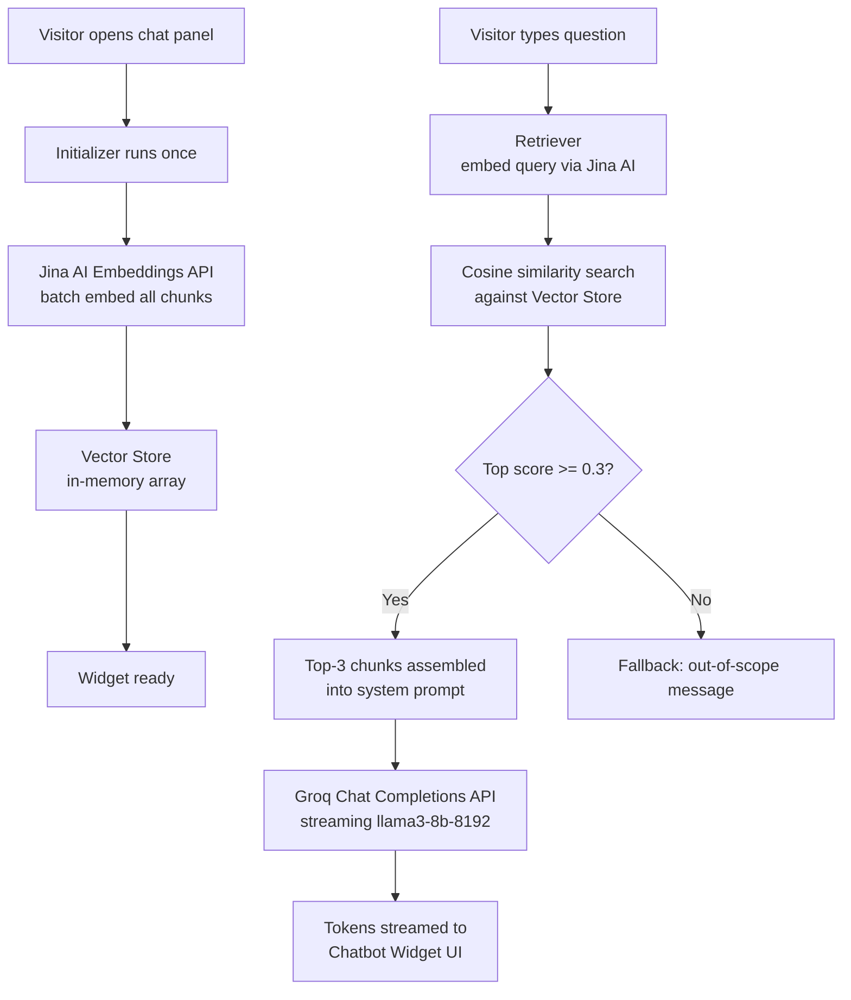
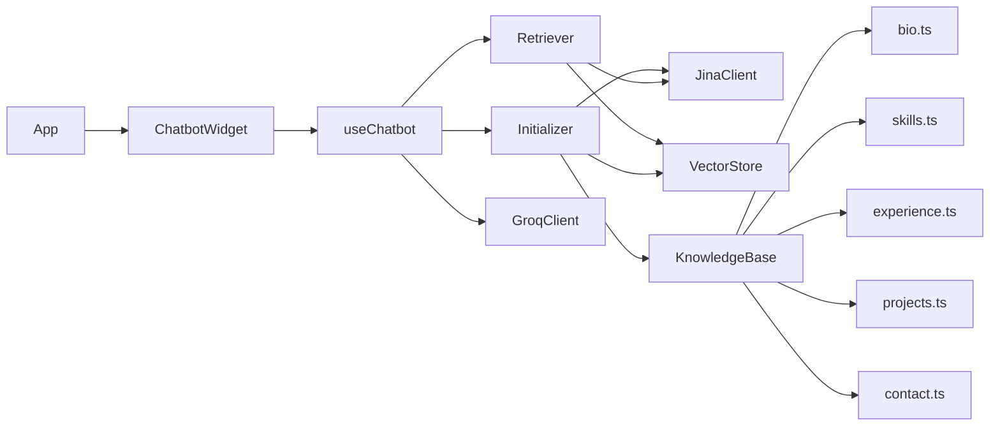

# Design Document: RAG Portfolio Chatbot

## Overview

This feature adds a Retrieval-Augmented Generation (RAG) chatbot widget to Qazi Farhan Ahmad's portfolio site. The widget floats in the bottom-right corner of every page and lets visitors ask natural-language questions about Qazi's background, skills, projects, and contact details. It answers using only grounded, curated knowledge — no hallucination, no external database, no backend server.

The entire pipeline runs in the browser:

1. A static knowledge base of TypeScript data files is chunked and embedded via the Jina AI Embeddings API on first widget open.
2. When a visitor asks a question, the query is embedded and compared against stored chunk embeddings using cosine similarity.
3. The top-3 most relevant chunks are assembled into a system prompt and sent to the Groq Chat Completions API (streaming).
4. The streamed response is rendered token-by-token in the chat panel.

The widget is lazy-loaded via `React.lazy` + `Suspense` and the embedding initializer only runs after the panel is first opened, ensuring zero impact on initial page load performance.

---

## Architecture

### High-Level Data Flow



### Module Dependency Graph



### File Structure

```
src/
└── lib/
    └── chatbot/
        ├── knowledge/
        │   ├── index.ts          # Aggregates all chunks with metadata
        │   ├── bio.ts            # Personal bio chunks
        │   ├── skills.ts         # Skills & technologies chunks
        │   ├── experience.ts     # Work experience chunks
        │   ├── projects.ts       # Project descriptions & URLs
        │   └── contact.ts        # Contact information chunks
        ├── vectorStore.ts        # In-memory store + cosine similarity
        ├── jinaClient.ts         # Jina AI Embeddings API wrapper
        ├── groqClient.ts         # Groq Chat Completions API wrapper
        ├── retriever.ts          # Query embedding + similarity search
        ├── initializer.ts        # One-time batch embedding on first open
        └── types.ts              # Shared TypeScript types
src/
└── components/
    └── chatbot/
        ├── ChatbotWidget.tsx     # Root widget (lazy-loaded entry point)
        ├── ChatPanel.tsx         # Expanded chat panel
        ├── MessageBubble.tsx     # Individual message rendering
        ├── TypingIndicator.tsx   # Three-dot pulsing animation
        └── useChatbot.ts         # State management hook
```

---

## Components and Interfaces

### `types.ts` — Shared Types

```typescript
export interface KnowledgeChunk {
  text: string;
  metadata: {
    topic: string;       // e.g. "bio", "skills", "experience", "projects", "contact"
    source: string;      // e.g. "experience-senior-mern"
  };
}

export interface VectorEntry {
  chunk: string;
  metadata: Record<string, string>;
  embedding: number[];
}

export type InitStatus = 'idle' | 'loading' | 'ready' | 'error' | 'misconfigured';

export interface ChatMessage {
  id: string;
  role: 'user' | 'assistant';
  content: string;
  timestamp: number;
}
```

### `knowledge/index.ts` — Knowledge Base Aggregator

Exports a single `ALL_CHUNKS: KnowledgeChunk[]` array by importing and spreading all topic files. Adding a new topic file only requires adding it to this index — the Initializer picks it up automatically.

```typescript
export const ALL_CHUNKS: KnowledgeChunk[] = [
  ...bioChunks,
  ...skillsChunks,
  ...experienceChunks,
  ...projectsChunks,
  ...contactChunks,
];
```

### `vectorStore.ts` — In-Memory Vector Store

```typescript
// Module-level singleton — persists for the browser session
let store: VectorEntry[] = [];

export function populateStore(entries: VectorEntry[]): void
export function searchStore(queryEmbedding: number[], topK: number): Array<{ entry: VectorEntry; score: number }>
export function clearStore(): void
export function isPopulated(): boolean
```

`searchStore` computes cosine similarity between `queryEmbedding` and every stored embedding, sorts descending, and returns the top `topK` results with their scores. The cosine similarity formula is:

```
similarity(A, B) = (A · B) / (|A| × |B|)
```

This is a pure in-memory operation with O(n) complexity over the chunk count. For ≤100 chunks it completes well under 100ms.

### `jinaClient.ts` — Jina AI Embeddings Wrapper

```typescript
export async function embedTexts(texts: string[]): Promise<number[][]>
// Calls POST https://api.jina.ai/v1/embeddings
// model: "jina-embeddings-v3"
// Authorization: Bearer ${VITE_JINA_API_KEY}
// Returns: array of embedding vectors, one per input text
```

Single function, single responsibility. Throws a typed `EmbeddingError` on non-2xx responses so callers can handle gracefully.

### `groqClient.ts` — Groq Chat Completions Wrapper

```typescript
export async function streamCompletion(
  systemPrompt: string,
  history: Array<{ role: 'user' | 'assistant'; content: string }>,
  userMessage: string,
  onToken: (token: string) => void,
  onDone: () => void,
  onError: (err: Error) => void
): Promise<void>
// Calls POST https://api.groq.com/openai/v1/chat/completions
// model: "llama3-8b-8192", stream: true, max_tokens: 300
// Authorization: Bearer ${VITE_GROQ_API_KEY}
// Reads SSE stream, calls onToken for each delta, onDone when finished
```

The system prompt template:

```
You are a helpful assistant for Qazi Farhan Ahmad's portfolio website.
Answer questions about Qazi based ONLY on the context provided below.
Be concise, professional, and friendly. Do not invent information.
If the context does not contain enough information to answer, say so politely.

CONTEXT:
---
{chunk1}
---
{chunk2}
---
{chunk3}
---
```

### `retriever.ts` — Semantic Retrieval

```typescript
export async function retrieve(
  query: string,
  topK: number = 3,
  threshold: number = 0.3
): Promise<{ chunks: string[]; belowThreshold: boolean }>
```

Steps:
1. Call `jinaClient.embedTexts([query])` to get the query embedding.
2. Call `vectorStore.searchStore(queryEmbedding, topK)`.
3. If the top result's score is below `threshold`, return `{ chunks: [], belowThreshold: true }`.
4. Otherwise return the top-K chunk texts.

### `initializer.ts` — One-Time Batch Embedding

```typescript
export async function initialize(): Promise<void>
// 1. Check VITE_JINA_API_KEY and VITE_GROQ_API_KEY — throw MisconfiguredError if missing
// 2. If vectorStore.isPopulated(), return immediately (idempotent)
// 3. Extract all chunk texts from ALL_CHUNKS
// 4. Call jinaClient.embedTexts(allTexts) — single batched request
// 5. Zip embeddings with chunks and call vectorStore.populateStore(entries)
```

The initializer is idempotent: calling it multiple times is safe because it checks `isPopulated()` before making any API calls.

### `useChatbot.ts` — State Management Hook

```typescript
interface ChatbotState {
  status: InitStatus;
  messages: ChatMessage[];
  isStreaming: boolean;
}

export function useChatbot(): {
  status: InitStatus;
  messages: ChatMessage[];
  isStreaming: boolean;
  sendMessage: (text: string) => Promise<void>;
  clearHistory: () => void;
  initializeIfNeeded: () => Promise<void>;
}
```

- `initializeIfNeeded` is called when the panel first opens. It sets `status = 'loading'`, calls `initializer.initialize()`, then sets `status = 'ready'` or `'error'`/`'misconfigured'`.
- `sendMessage` appends the user message, calls `retriever.retrieve()`, assembles the system prompt, calls `groqClient.streamCompletion()`, and updates the assistant message incrementally via `onToken`.
- Conversation history is capped at 20 message pairs (40 messages total). When the limit is reached, the oldest pair is dropped before appending new messages.
- Only the last 4 turns (8 messages) are sent to Groq as chat history to stay within context limits.

### `ChatbotWidget.tsx` — Lazy-Loaded Root

The entry point exported via `React.lazy`. Renders the floating toggle button at all times. Conditionally renders `<ChatPanel>` when open. Manages the open/closed toggle state.

```tsx
// In App.tsx:
const ChatbotWidget = React.lazy(() => import('./components/chatbot/ChatbotWidget'));

// Wrapped in Suspense with null fallback (button appears after lazy chunk loads)
<Suspense fallback={null}>
  <ChatbotWidget />
</Suspense>
```

### `ChatPanel.tsx` — Chat Panel

Renders the expanded panel with:
- Header: "Ask about Qazi" title + close button + clear chat button
- Message history area (scrollable, auto-scrolls to bottom on new message)
- Empty state: suggested prompt when history is empty
- `<TypingIndicator>` while streaming before first token
- Text input + send button (disabled while streaming or loading)

### `MessageBubble.tsx` — Message Rendering

- User messages: right-aligned, `bg-white text-black` pill
- Assistant messages: left-aligned, `bg-white/5 text-white` pill with subtle border
- Timestamps rendered as relative time (e.g., "just now")

### `TypingIndicator.tsx` — Animated Dots

Three dots with staggered `animate-bounce` (or `animate-pulse` when `prefers-reduced-motion: reduce` is active). Shown only while `isStreaming && messages[last].content === ''`.

---

## Data Models

### Knowledge Base Chunks

Each topic file exports a typed array of `KnowledgeChunk`. Example structure for `projects.ts`:

```typescript
export const projectsChunks: KnowledgeChunk[] = [
  {
    text: `CSSUOP (https://cssuop.org): Official website for the Computer Science Student Union of the University of the Punjab. Built with Next.js. A full-stack organization website.`,
    metadata: { topic: 'projects', source: 'project-cssuop' },
  },
  {
    text: `Hikescape Full-Stack App (https://hiking-app-puce.vercel.app/): A comprehensive MERN stack application for hiking enthusiasts with authentication and maps. Technologies: MongoDB, Express, React, Node.js, Cloudinary.`,
    metadata: { topic: 'projects', source: 'project-hikescape' },
  },
  {
    text: `Agency X AI (https://agencyxai.netlify.app): A modern AI agency landing page with sophisticated animations and glassmorphism. Built with Next.js, Framer Motion.`,
    metadata: { topic: 'projects', source: 'project-agencyxai' },
  },
  {
    text: `QBuilds Architecture (https://qbulids.netlify.app): High-end architectural portfolio featuring immersive visual storytelling. Built with React and GSAP.`,
    metadata: { topic: 'projects', source: 'project-qbuilds' },
  },
  {
    text: `Carry Fashion Ecommerce (https://ecommercestoreqazi.netlify.app): A fast, modern e-commerce storefront with integrated shopping features. Built with React, Redux, Vite.`,
    metadata: { topic: 'projects', source: 'project-carry' },
  },
];
```

Each chunk is kept under 500 tokens. Longer topics (e.g., experience) are split into one chunk per role.

### Vector Store Entry

```typescript
interface VectorEntry {
  chunk: string;                    // raw text of the chunk
  metadata: Record<string, string>; // { topic, source }
  embedding: number[];              // 1024-dimensional float array (jina-embeddings-v3)
}
```

The store is a module-level `VectorEntry[]` array. It is populated once per browser session and never persisted to `localStorage` (embeddings are large and the Jina API is fast enough to re-embed on page reload).

### Chat Message

```typescript
interface ChatMessage {
  id: string;          // crypto.randomUUID()
  role: 'user' | 'assistant';
  content: string;     // full text; grows incrementally during streaming
  timestamp: number;   // Date.now()
}
```

Messages are stored in React component state (`useState<ChatMessage[]>`). They are not persisted across page reloads — only within the current browser session.

### Environment Variables

| Variable | Purpose |
|---|---|
| `VITE_JINA_API_KEY` | Authenticates requests to `api.jina.ai` |
| `VITE_GROQ_API_KEY` | Authenticates requests to `api.groq.com` |

Both are read via `import.meta.env.VITE_*` at runtime. If either is absent, the widget enters `'misconfigured'` status and displays a configuration error message instead of the chat interface.

---

## Correctness Properties

*A property is a characteristic or behavior that should hold true across all valid executions of a system — essentially, a formal statement about what the system should do. Properties serve as the bridge between human-readable specifications and machine-verifiable correctness guarantees.*

### Property 1: Knowledge base chunk size invariant

*For any* chunk in `ALL_CHUNKS`, its text length shall be no more than 2000 characters (approximating the 500-token limit at ~4 chars/token).

**Validates: Requirements 1.4**

---

### Property 2: Initializer embeds all chunks and populates the store

*For any* non-empty array of `KnowledgeChunk` objects passed to the initializer (with a mocked Jina API), the vector store shall contain exactly one `VectorEntry` per input chunk, with the chunk text and metadata preserved and the embedding set to the value returned by the mock.

**Validates: Requirements 1.3, 2.1, 2.6**

---

### Property 3: Initializer uses a single batched API call

*For any* non-empty array of knowledge chunks, the initializer shall call the Jina embeddings API exactly once, regardless of how many chunks are in the array.

**Validates: Requirements 2.4**

---

### Property 4: Cosine similarity is bounded and self-similar

*For any* two non-zero vectors A and B, `cosineSimilarity(A, B)` shall return a value in the range [-1, 1]. *For any* non-zero vector A, `cosineSimilarity(A, A)` shall equal 1 (within floating-point tolerance).

**Validates: Requirements 3.2**

---

### Property 5: Retriever returns top-K results in descending score order

*For any* populated vector store with N ≥ topK entries and any query embedding, the retriever shall return exactly `topK` results ordered by descending cosine similarity score, where each returned score is greater than or equal to the score of the next result.

**Validates: Requirements 3.3**

---

### Property 6: System prompt contains all retrieved chunks with delimiters

*For any* non-empty array of context chunk strings, the assembled system prompt shall contain each chunk's text and shall delimit each chunk with the `---` separator, and shall include the instruction to answer only from the provided context.

**Validates: Requirements 4.1, 4.3**

---

### Property 7: Streaming delivers all tokens in order

*For any* sequence of token strings in a mocked SSE stream, the `onToken` callback shall be called exactly once per token, in the same order as they appear in the stream.

**Validates: Requirements 4.6**

---

### Property 8: Chat history sent to Groq is capped at 4 turns

*For any* conversation history of length N, the messages array sent to the Groq API shall contain at most 8 messages (4 user + 4 assistant turns), and shall always be the most recent messages in the history.

**Validates: Requirements 4.7**

---

### Property 9: Chat panel toggle is a round-trip

*For any* open/closed state of the chat panel, clicking the toggle button shall flip the state: open becomes closed, closed becomes open.

**Validates: Requirements 5.3**

---

### Property 10: Message bubble alignment matches role

*For any* `ChatMessage` with `role = 'user'`, the rendered bubble shall have right-alignment styling. *For any* `ChatMessage` with `role = 'assistant'`, the rendered bubble shall have left-alignment styling.

**Validates: Requirements 5.5**

---

### Property 11: Conversation history is capped at 20 message pairs

*For any* sequence of messages added to the chat (where the total exceeds 40 messages), the stored history shall never exceed 40 messages and shall always contain the most recently added messages.

**Validates: Requirements 7.5**

---

### Property 12: Close and reopen preserves conversation history

*For any* non-empty conversation history, closing the chat panel and reopening it shall display the same messages in the same order.

**Validates: Requirements 7.2**

---

## Error Handling

### Missing API Keys (`misconfigured` status)

When `import.meta.env.VITE_JINA_API_KEY` or `import.meta.env.VITE_GROQ_API_KEY` is `undefined` or empty at runtime, the initializer throws a `MisconfiguredError` before making any network calls. The `useChatbot` hook catches this and sets `status = 'misconfigured'`. The widget renders a static message: *"Chatbot is not configured. Please set the required environment variables."* The input field is hidden entirely.

### Jina AI API Error During Initialization (`error` status)

If the Jina embeddings API returns a non-2xx response or the network request fails, the initializer throws an `EmbeddingError`. The hook sets `status = 'error'`. The widget renders: *"The assistant is temporarily unavailable. Please try again later."* The input field is disabled.

### Jina AI API Error During Query

If the query embedding call fails (inside `retriever.retrieve()`), the error propagates to `useChatbot.sendMessage()`, which appends an assistant message with the text: *"Sorry, I'm having trouble connecting right now. Please try again shortly."* The `isStreaming` flag is reset to `false`.

### Groq API Error During Streaming

If the Groq API returns a non-2xx response or the SSE stream errors, `groqClient.streamCompletion()` calls `onError`. The hook appends or replaces the in-progress assistant message with: *"Sorry, I'm having trouble connecting right now. Please try again shortly."* Streaming is terminated and `isStreaming` is reset.

### Below-Threshold Retrieval

When `retriever.retrieve()` returns `{ belowThreshold: true }`, the Groq client is called with an empty context array and the system prompt instructs the LLM to respond with a polite out-of-scope message. No error state is set — this is a normal flow.

### Idempotent Initialization

The initializer checks `vectorStore.isPopulated()` before making any API calls. If the store is already populated (e.g., the user closes and reopens the panel), initialization returns immediately without any network requests.

---

## Testing Strategy

### Overview

The testing approach uses two complementary layers:

- **Unit / example-based tests**: Verify specific behaviors, error conditions, and UI states with concrete inputs.
- **Property-based tests**: Verify universal invariants across randomly generated inputs using [fast-check](https://github.com/dubzzz/fast-check) (the standard PBT library for TypeScript/JavaScript).

Property tests are configured to run a minimum of 100 iterations each. Unit tests focus on specific examples, integration points, and error conditions that are not covered by properties.

### Property-Based Tests

Each property test is tagged with a comment referencing the design property it validates.

**Tag format:** `// Feature: rag-portfolio-chatbot, Property {N}: {property_text}`

| Property | Test Description | Module Under Test |
|---|---|---|
| P1 | All chunks in ALL_CHUNKS have text ≤ 2000 chars | `knowledge/index.ts` |
| P2 | Initializer stores one entry per chunk with correct data | `initializer.ts` (mocked Jina) |
| P3 | Initializer calls Jina API exactly once for any chunk count | `initializer.ts` (mocked Jina) |
| P4 | Cosine similarity is in [-1,1]; self-similarity = 1 | `vectorStore.ts` |
| P5 | Retriever returns topK results in descending score order | `retriever.ts` (mocked Jina + store) |
| P6 | System prompt contains all chunks with delimiters | `groqClient.ts` (prompt assembly) |
| P7 | onToken called once per token in stream order | `groqClient.ts` (mocked SSE) |
| P8 | History sent to Groq capped at 8 messages (4 turns) | `groqClient.ts` |
| P9 | Toggle button flips open/closed state | `ChatbotWidget.tsx` |
| P10 | Message bubble alignment matches role | `MessageBubble.tsx` |
| P11 | Stored history never exceeds 40 messages | `useChatbot.ts` |
| P12 | Close/reopen preserves history | `ChatbotWidget.tsx` |

### Unit / Example-Based Tests

| Requirement | Test Description |
|---|---|
| 1.1 | ALL_CHUNKS contains entries for all 5 required topics |
| 2.2 | Jina API request body contains `model: "jina-embeddings-v3"` |
| 2.3 | Jina 500 error → initializer rejects → widget status = 'error' |
| 2.5 | Widget with status='loading' renders loading indicator, input disabled |
| 3.4 | All scores below 0.3 → retriever returns `{ chunks: [], belowThreshold: true }` |
| 4.2 | Groq API request body contains `model: "llama3-8b-8192"` |
| 4.4 | Groq API request body contains `max_tokens: 300` |
| 4.5 | Groq 500 error → onError called with error |
| 5.2 | Clicking toggle button opens chat panel |
| 5.6 | isStreaming=true + empty last message → typing indicator visible |
| 5.9 | After message added, scroll position is at bottom |
| 5.10 | Empty history → suggested prompt visible |
| 6.5 | Missing VITE_JINA_API_KEY → MisconfiguredError → widget shows config message |
| 7.1 | Messages persist in state across re-renders |
| 7.3 | Clear button resets history to empty |
| 7.4 | After clear, suggested prompt is visible |
| 8.2 | Initializer not called until panel is first opened |
| 8.4 | prefers-reduced-motion: reduce → animation classes absent |

### Test Setup Notes

- **Mocking Jina AI**: Use `vi.mock` (Vitest) or `jest.mock` to mock `jinaClient.ts`. Return deterministic embeddings (e.g., unit vectors) for property tests.
- **Mocking Groq SSE**: Mock `fetch` to return a `ReadableStream` that emits SSE events with configurable token sequences.
- **Environment variables**: Use `vi.stubEnv` to set/unset `VITE_JINA_API_KEY` and `VITE_GROQ_API_KEY` in tests.
- **fast-check generators**: Use `fc.array(fc.float())` for embedding vectors, `fc.string()` for chunk texts, `fc.array(fc.record({ role: fc.constantFrom('user', 'assistant'), content: fc.string() }))` for conversation history.
- **React Testing Library**: Use for all component tests (`ChatbotWidget`, `MessageBubble`, `TypingIndicator`).

### Recommended Test Runner

**Vitest** — already compatible with the Vite 7 build setup. Add `fast-check` as a dev dependency for property tests.

```bash
npm install --save-dev vitest @testing-library/react @testing-library/user-event fast-check jsdom
```
